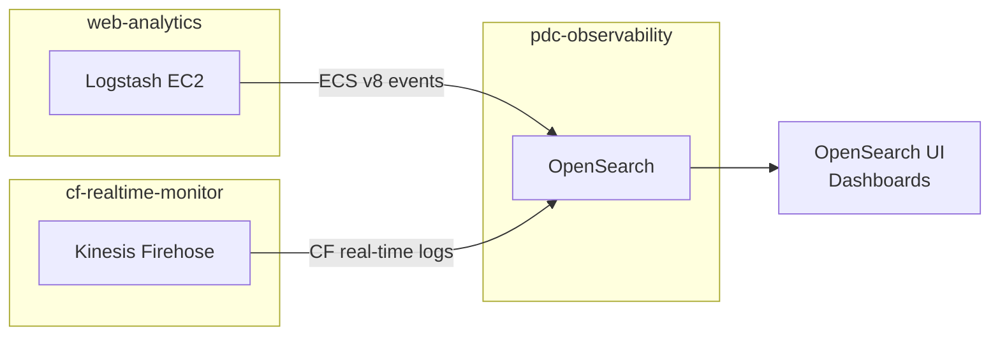

# Planetary Data Cloud (PDC) Observability

Shared OpenSearch-backed Observability platform for the Planetary Data Cloud. Aggregates logs from PDS services such as web-analytics and CloudFront realtime monitoring for search and dashboards

## Architecture

OpenSearch is a shared platform — both web-analytics and cf-realtime-monitor write to it. Consumers discover the endpoint via SSM with no shared Terraform state between repos. See [`terraform/README.md`](terraform/README.md) for the full technical architecture and AWS resource details.

## Components

| Component | Path | Description |
|---|---|---|
| OpenSearch domain | `terraform/opensearch/` | Shared VPC-only OpenSearch cluster |

## Consumers

| Repo | What it writes |
|---|---|
| [web-analytics](https://github.com/NASA-PDS/web-analytics) | Parsed PDS node access logs (ECS v8) |
| [cf-realtime-monitor](https://github.com/NASA-PDS/cf-realtime-monitor) | CloudFront real-time log stream |

## Development

Install in editable mode with dev dependencies:

    pip install --editable '.[dev]'

See [the wiki entry on Secrets](https://github.com/NASA-PDS/nasa-pds.github.io/wiki/Git-and-Github-Guide#detect-secrets) to install and set up detect-secrets.

Then configure the `pre-commit` hooks:

    pre-commit install
    pre-commit install -t pre-push
    pre-commit install -t prepare-commit-msg
    pre-commit install -t commit-msg

👉 **Note:** A one-time setup is required both to support `detect-secrets` and in your global Git configuration. See [the wiki entry on Secrets](https://github.com/NASA-PDS/nasa-pds.github.io/wiki/Git-and-Github-Guide#detect-secrets) to learn how.

## Infrastructure

See [`terraform/README.md`](terraform/README.md) for deployment steps and Terraform module details.
