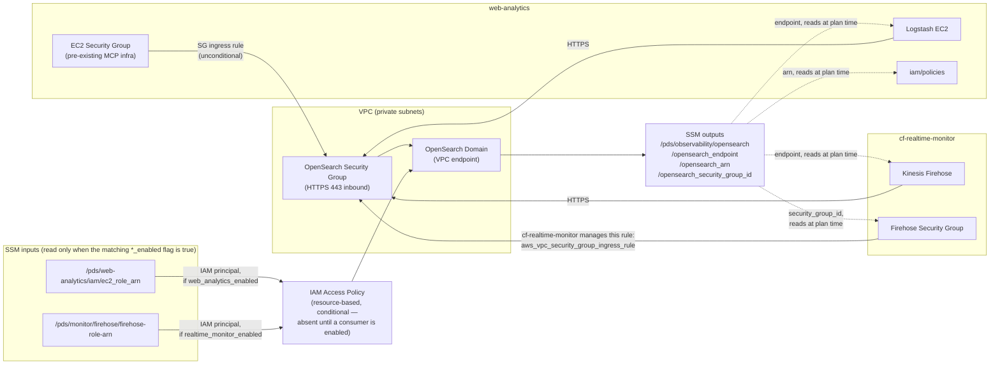
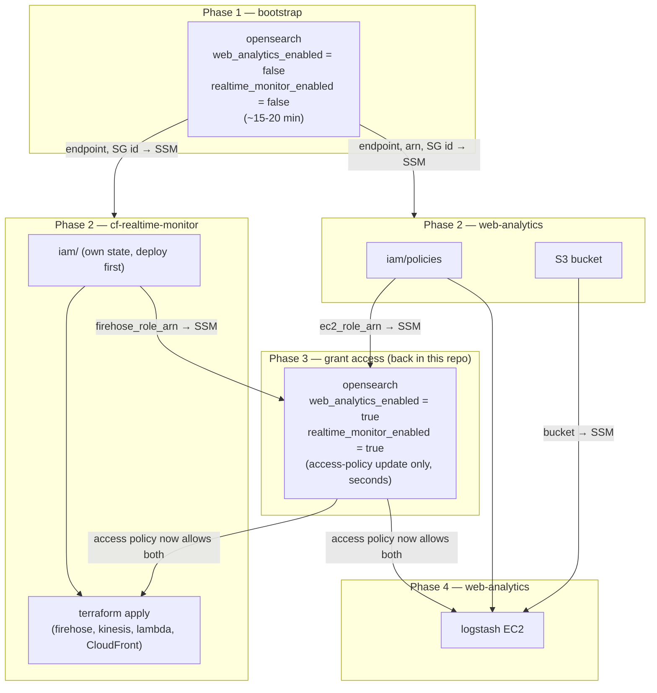

# PDS Observability — Terraform

Deploys the shared observability infrastructure for the NASA Planetary Data System. Consumers connect via SSM — no cross-repo Terraform dependencies.

## Technical architecture



Network access is controlled by Security Group ingress rules (port 443). The EC2 SG rule lives here, since the MCP EC2 SG is pre-existing shared infra; the Firehose SG rule is instead created and owned by cf-realtime-monitor itself, as a separate `aws_vpc_security_group_ingress_rule` resource targeting this repo's SG by ID (read from SSM) — this repo no longer takes a Firehose SG ID as an input. API access is controlled by an IAM resource-based policy whose principals are role ARNs read from SSM at plan time, gated by the `web_analytics_enabled` / `realtime_monitor_enabled` flags (see [Access control](#access-control)) so the domain can bootstrap before either consumer exists. The domain's endpoint, ARN, and security group ID are published to SSM after deploy; consumers read them at Terraform plan time (dashed lines) with no shared state between repos. The ARN is consumed by web-analytics' `iam/policies` module to scope the Logstash EC2 role's OpenSearch permissions.

## Deployment flow



1. **(1) Bootstrap OpenSearch** — with `web_analytics_enabled = false` and `realtime_monitor_enabled = false` in tfvars: `task opensearch:deploy VENUE=dev` (~15-20 min). Publishes endpoint, ARN, and security group ID to SSM. The domain has **no access policy yet** at this point — that's expected, since neither consumer has published a role ARN.
2. **(2) Deploy both consumers** — each reads what it needs from SSM at plan time and can deploy immediately after step 1 completes, independently of the other:
   - `web-analytics`: `task iam:deploy VENUE=dev` (publishes `ec2_role_arn`), then `task s3:deploy VENUE=dev`
   - `cf-realtime-monitor`: `iam/` module first — own state, publishes `firehose_role_arn` — then the root module (creates the Firehose infra plus its own Firehose→OpenSearch security-group ingress rule, referencing this repo's SG ID from SSM)
   - Both `terraform apply`s in this phase succeed, but neither Logstash nor Firehose can actually reach the OpenSearch API yet — the access policy from step 1 doesn't grant them anything.
3. **(3) Grant access** — back in this repo, set `web_analytics_enabled = true` and/or `realtime_monitor_enabled = true` in tfvars (independently, whenever each consumer's `iam` module has published its ARN) and re-run `task opensearch:deploy VENUE=dev`. This only updates the access policy — no domain redeployment.
4. **(4) Finish web-analytics** — `task logstash:deploy VENUE=dev` — reads OpenSearch endpoint and bucket name from SSM at plan time.

No manual `aws ssm put-parameter` seeding is required anywhere in this flow — each side publishes what the other needs, and the `*_enabled` flags let this repo bootstrap before either consumer exists.

---

## Prerequisites

- [Terraform](https://developer.hashicorp.com/terraform/downloads) >= 1.10.0
- [Task](https://taskfile.dev) — `brew install go-task/tap/go-task`
- AWS credentials exported:
  ```bash
  eval $(aws configure export-credentials --profile <your-profile> --format env)
  unset AWS_PROFILE  # required for Terraform S3 backend compatibility
  ```

---

## Setup

tfvars are tracked in the `cds-infra-deploy` repo (private GitLab, not GitHub) at
`venues/<venue>/observability/opensearch.tfvars`, not in this repo — `*.tfvars` here is
gitignored. Point Task at a local checkout of that repo:

```bash
export CDS_INFRA_DEPLOY_DIR=/path/to/cds-infra-deploy
cd terraform/
task opensearch:plan VENUE=dev
```

For personal iteration before promoting values to `cds-infra-deploy`, pass `LOCAL=1` to use
this repo's own (gitignored) `opensearch/tfvars/<venue>.tfvars` instead:

```bash
cp opensearch/tfvars/dev.tfvars.example opensearch/tfvars/dev.tfvars
# Edit dev.tfvars: set domain_name, vpc_id, vpc_subnet_ids, ec2_security_group_name
task opensearch:plan VENUE=dev LOCAL=1
```

| Variable | Notes |
|---|---|
| `vpc_id`, `vpc_subnet_ids` | VPC where the OpenSearch endpoint is placed (private subnets) |
| `ec2_security_group_name` | MCP EC2 SG name — allows Logstash HTTPS inbound (pre-existing shared infra, unconditional) |
| `web_analytics_enabled` | Set `false` for the initial bootstrap deploy; `true` once web-analytics' `iam/policies` module has published `ec2_role_arn` — see [Access control](#access-control) |
| `realtime_monitor_enabled` | Set `false` for the initial bootstrap deploy; `true` once cf-realtime-monitor's `iam/` module has published `firehose_role_arn` — see [Access control](#access-control) |

No Firehose SG ID input is needed — cf-realtime-monitor creates its own ingress rule against this domain's SG (see [Technical architecture](#technical-architecture)).

---

## Deployment

### OpenSearch domain — 🔑 Power-User (~15-20 min)

```bash
cd terraform/

task opensearch:init    VENUE=dev
task opensearch:plan    VENUE=dev LOCAL=1
task opensearch:deploy  VENUE=dev LOCAL=1
task opensearch:endpoint             # confirm endpoint stored in SSM
```

After deploy, the endpoint, domain ARN, and security group ID are published to SSM automatically:
```
/pds/observability/opensearch/opensearch_endpoint
/pds/observability/opensearch/opensearch_arn
/pds/observability/opensearch/opensearch_security_group_id
```

See [Deployment flow](#deployment-flow) above for when to re-run this with `web_analytics_enabled` / `realtime_monitor_enabled` set to `true`.

---

## Access control

OpenSearch uses IAM resource-based access (no FGAC). Principals are read from SSM at plan time, each gated by a tfvars flag so this repo can bootstrap before either consumer exists:

| tfvars flag | SSM path (read only when the flag is `true`) | Published by |
|---|---|---|
| `web_analytics_enabled` | `/pds/web-analytics/iam/ec2_role_arn` | web-analytics `iam/policies` module on deploy |
| `realtime_monitor_enabled` | `/pds/monitor/firehose/firehose-role-arn` | cf-realtime-monitor `iam/` module on deploy |

Both default to `false`. With both false, `aws_opensearch_domain_policy` isn't created at all — an access policy with an empty `Principal.AWS` is invalid, and on the initial bootstrap deploy neither ARN exists in SSM yet. Once a consumer's `iam` module has deployed and published its role ARN, flip the matching flag to `true` in tfvars and re-run `task opensearch:deploy VENUE=<venue>` (or `task opensearch:plan` first to confirm) — this only updates the access policy, no domain redeployment. The two flags are independent, so each consumer can be enabled as soon as it's ready without waiting on the other.

No manual `aws ssm put-parameter` seeding is required — see [Deployment flow](#deployment-flow) for the full sequence.

---

## Teardown

```bash
task opensearch:destroy VENUE=dev   # destroys all indexed data — irreversible
```

---

## Architecture notes

- **State** — S3 backend, key `observability/opensearch.tfstate`.
- **VPC/SG values** are in tfvars. TODO: source EC2 SG from SSM under `/pds/cds-infra/vpc/security_groups/` once MCP publishes it.
- **Adding a new consumer** — publish its role ARN to SSM, add a `data "aws_ssm_parameter"` block in `opensearch/main.tf`, add the ARN to the access policy principals, and add an SG ingress rule if needed.
